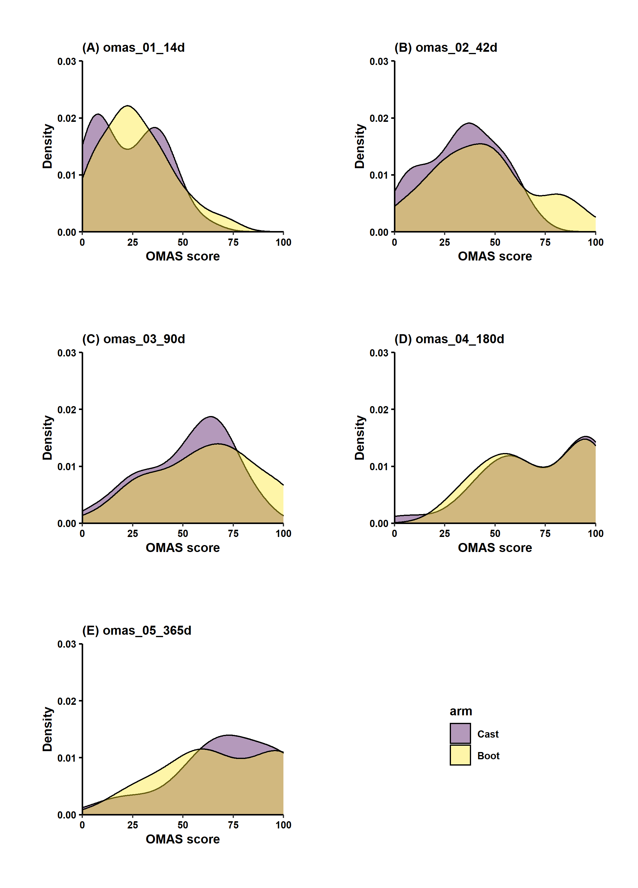

## Background

Post-operative management regimes vary following open reduction and internal
fixation (ORIF) of unstable ankle fractures. There is an evolving understanding that
extended periods of immobilisation and limitation of weight-bearing may lead to poorer
clinical outcomes. Traditional non-weight bearing cast immobilisation may prevent loss
of fixation, and this practice continues in many centres. 

The purpose of this trial is to investigate the safety and efficacy of immediate weight-bearing (IWB) and range of motion (ROM) exercise regimes following ORIF of unstable ankle fractures with a particular focus on functional outcomes and complication rates.

### Data summary

```{r setup, include = FALSE}

  knitr::opts_chunk$set(echo = FALSE, message = FALSE, warning = FALSE, 
                        fig.width  = 6 * 1.67, fig.height = 6)

# Packages
library('readxl')
library('tidyverse')
library('testthat')
library('viridis')
library('janitor')
library('summarytools')
library('kableExtra')

```

```{r data, echo = FALSE, message = FALSE}

source('scripts/01_data_cleaning.R')

library('kableExtra')
library('summarytools')
library('stringr')
```

_**Table 1. Patient demographics**_
```{r table 1 patients, echo = FALSE, message = FALSE, results='markup'}

boot <- tibble(Variable = name.1(table1_boot),
       "Mean SD" = summary.1(table1_boot),
       "(Min, Max)" = min.max(table1_boot))

cast <- tibble(Variable = name.1(table1_cast),
       "Mean SD" = summary.1(table1_cast),
       "(Min, Max)" = min.max(table1_cast))

cbind(boot, cast) %>%
  kable(format = "html", digits = 2) %>% # Align text left (col 1), right (Col2) ...
  kable_styling(bootstrap_options = c("striped", "condensed"), 
                full_width = FALSE, font_size = 10) %>%
  row_spec(0, bold = TRUE) %>%
  column_spec(c(1,4), bold = TRUE) %>%
  footnote(general = 'Lefthand side - Boot, Righthand side - Cast',
           footnote_as_chunk = T, title_format = c('italic', 'underline'))

```

### Primary outcome: Olerud-Molander Ankle Score (OMAS)

_**Table 2. Summary of OMAS scores across all sampling points**_
```{r table 2 omas, echo = FALSE, message = FALSE, results='markup'}

primary_omas <- data %>%
  select(arm, starts_with("omas")) %>%
  group_by(arm) %>%
  descr(stats = 'common') %>%
  tb(order = 2) %>%
  select(-pct.valid)

primary_omas$variable <-  str_replace_all(primary_omas$variable, 'omas_0[1-5]_', '')

names(primary_omas) <- c('Arm', 'Sampling point', 'Mean',
                         'SD', 'Min', 'Median', 'Max', 'Valid data points')

primary_omas %>%
  kable(format = "html", digits = 2,
        align = c("lccccccc")) %>% # Align text left (col 1), right (Col2) ...
  kable_styling(bootstrap_options = c("striped", "condensed"), 
                full_width = FALSE, font_size = 10) %>%
  row_spec(0, bold = TRUE) %>%
  column_spec(1, bold = TRUE) %>%
  collapse_rows(columns = 1, valign = "top") %>%
  footnote(general = 'Follow up is ongoing with 3 month, 6 month and 1 year post-surgery readings absent for the majority of patients',
           footnote_as_chunk = T, title_format = c('italic', 'underline'))

```


**Fig. OMAS density plots by sampling point**
```{r omas plot, echo=FALSE, out.width = '100%'}

```

Note: The density plot is a representation of the distribution of a numeric variable akin to a histrgram. The data is fed to a probabilty density function to give it the smooth appearence. Again, we need to recognise that more data points are available for earlier periods in the study at the present time.

Figure 1 and Table 1 provide early indications of a better outcome for those patients prescribed a boot over those patients prescribed a cast.

_**Table 3. Summary of SF36 physical health data across all sampling points**_
```{r table 3 sf_ph, echo = FALSE, message = FALSE, results='markup'}

sf_ph <- data %>%
  select(arm, starts_with("sf_ph")) %>%
  group_by(arm) %>%
  descr(stats = 'common') %>%
  tb(order = 2) %>%
  select(-pct.valid)

sf_ph$variable <-  str_replace_all(sf_ph$variable, 
                                          'sf_ph_0[1-5]_', '')

names(sf_ph) <- c('Arm', 'Sampling point', 'Mean',
                         'SD', 'Min', 'Median', 'Max', 'Valid data points')

sf_ph %>%
  kable(format = "html", digits = 2,
        align = c("lccccccc")) %>% # Align text left (col 1), right (Col2) ...
  kable_styling(bootstrap_options = c("striped", "condensed"), 
                full_width = FALSE, font_size = 10) %>%
  row_spec(0, bold = TRUE) %>%
  column_spec(1, bold = TRUE) %>%
  collapse_rows(columns = 1, valign = "top")

```


_**Table 4. Summary of SF36 mental health data across all sampling points**_
```{r table 4 sf_mh, echo = FALSE, message = FALSE, results='markup'}

sf_mh <- data %>%
  select(arm, starts_with("sf_mh")) %>%
  group_by(arm) %>%
  descr(stats = 'common') %>%
  tb(order = 2) %>%
  select(-pct.valid)

sf_mh$variable <-  str_replace_all(sf_mh$variable, 
                                          'sf_mh_0[1-5]_', '')

names(sf_mh) <- c('Arm', 'Sampling point', 'Mean',
                         'SD', 'Min', 'Median', 'Max', 'Valid data points')

sf_mh %>%
  kable(format = "html", digits = 2,
        align = c("lccccccc")) %>% # Align text left (col 1), right (Col2) ...
  kable_styling(bootstrap_options = c("striped", "condensed"), 
                full_width = FALSE, font_size = 10) %>%
  row_spec(0, bold = TRUE) %>%
  column_spec(1, bold = TRUE) %>%
  collapse_rows(columns = 1, valign = "top")

```

There did not appear to be any noticable difference between study arms with respect tothe SF36 physical health or SF36 mental health assessments.

## Proportional odds model of OMAS function

The scoring system used for the OMAS measure is not a continuous variable. Rather it is bounded between 0-100, and can take possible values in increments of five units. For example, it cannot be claimed that an OMAS score of 20 represents one fifth the mobility of an individual with a score of 100, given that the units that comprise this score come from a variety of measures (pain, stiffness, swelling, jumping etc.).

As such, alternatives to traditional statistical methods such as t-tests and linear models should be considered in this instance. In the following example a proportional odds model has been employed.

**Models were constructed of the form:**

`OMAS reading ~ Study arm + rcs(age, 3) + Length of hospital stay` 


_**Table 5. Prliminary outputs of the proportional odds model for OMAS readings at 2 weeks and 6 weeks**_
```{r stats, echo = FALSE, message = FALSE}
library('rms')

omas_tbl <- data %>%
  select(id, arm, age, hospital_stay,
         omas_01_14d, omas_02_42d)

dd = datadist(omas_tbl)
options(datadist="dd", digits = 4)

# Proportional odds model -------------------------------------------------
# orm is from the hms package and is the equivalent of MASS::polr
# i.e. Ordered Logistic or Probit Regression

# 2 weeks
po_omas_2wk <- orm(
  omas_01_14d ~ arm + rcs(age, 3) + # Adding a restricted cubic spline without assuming linearity
    hospital_stay,
  data = omas_tbl, x = TRUE, y = TRUE)

# 6 weeks
po_omas_6wk <- orm(
  omas_02_42d ~ arm + rcs(age, 3) + # Adding a restricted cubic spline without assuming linearity
    hospital_stay,
  data = omas_tbl, x = TRUE, y = TRUE)


# Model output

model_out <- tibble(variable = character(),
                    rho = numeric(),
                    R2 = numeric(),
                    p_value = numeric())

# Populate with the 2 week  model
names <- c('po_omas_2wk', 'po_omas_6wk')
for (i in names) {
  model_out <- model_out %>%
    bind_rows(list(variable = i,
                   rho = get(i)$stats[["rho"]],
                   R2 = get(i)$stats[["R2"]],
                   p_value = get(i)$stats[["P"]]))
  
}

model_out %>%
  mutate(p_value = ifelse(p_value < 0.001, "< 0.001", round(p_value, 3))) %>%
  kable(format = "html", digits = 4,
        align = c("lccc")) %>% # Align text left (col 1), right (Col2) ...
  kable_styling(bootstrap_options = c("striped", "condensed"), 
                full_width = FALSE, font_size = 10) %>%
  row_spec(0, bold = TRUE) %>%
  column_spec(1, bold = TRUE) %>%
  collapse_rows(columns = 1, valign = "top")

```

## Linear model of OMAS function

**Models were constructed of the form:**

`OMAS reading ~ Study arm + age + Length of hospital stay` 

_**Table 6. Prliminary outputs of linear regression OMAS readings at 2 weeks and 6 weeks**_
```{r linear model, echo = FALSE, message = FALSE}

wk2_lm <- lm(omas_01_14d ~ arm + age + hospital_stay, omas_tbl)

out_2wk <- tidy(wk2_lm) %>%
  cbind(as_tibble(confint(wk2_lm)))

omas_tbl <- data %>%
  select(id, arm, age, hospital_stay,
         omas_01_14d, omas_02_42d)
wk6_lm <- lm(omas_02_42d ~ arm + age + hospital_stay, omas_tbl)

out_6wk <- tidy(wk6_lm) %>%
  cbind(as_tibble(confint(wk6_lm)))

# Model output
info <- tibble(Variable = c('Intercept',
                            'Boot - 2wks', 
                            'Age - 2wks',
                            'Hospital stay - 2wks',
                            'Intercept',
                            'Boot - 6wks', 
                            'Age - 6wks',
                            'Hospital stay - 6wks'))
rbind(out_2wk, out_6wk) %>%
  cbind(info) %>%
  select(Variable, everything()) %>% 
  select(-term) %>%
  filter(Variable %in% c('Boot - 2wks', 
                            'Boot - 6wks')) %>%

  mutate(p.value = ifelse(p.value < 0.001, "< 0.001", round(p.value, 3))) %>%
  kable(format = "html", digits = 4,
        align = c("lccc")) %>% # Align text left (col 1), right (Col2) ...
  kable_styling(bootstrap_options = c("striped", "condensed"), 
                full_width = FALSE, font_size = 10) %>%
  row_spec(0, bold = TRUE) %>%
  column_spec(1, bold = TRUE) %>%
  collapse_rows(columns = 1, valign = "top")

```

### Preliminary summary of the analysis

2 weeks post-surgery:  Mean OMAS score for the boot was 2.9 units higher than with the cast (95% CI -3.38, 9.16) p = 0.364.

6 weeks post-surgery:  Mean OMAS score for the boot was 9.5 units higher than with the cast (95% CI 1.48, 17.52) p = 0.021.
